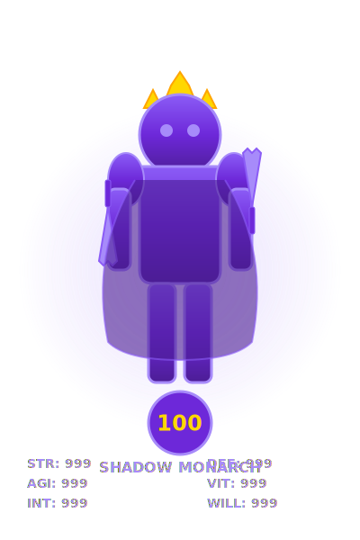

# 🎮 Goal Quest - Gamified Habit & Goal Tracking

<div align="center">



[](https://www.typescriptlang.org/)
[](https://reactjs.org/)
[](https://tailwindcss.com/)
[](https://www.postgresql.org/)
[](https://railway.app/template/goal-quest)

**Transform your personal development journey into an epic RPG adventure**

[Live Demo](#) • [Features](#features) • [Installation](#installation) • [Deploy to Railway](./RAILWAY.md) • [Documentation](./docs)

</div>

---

## ✨ Features

### 🎯 Core Features

- **🎮 RPG-Style Progression**
  - Level up from Beginner (Level 1) to Shadow Monarch (Level 100)
  - 6 core stats: Strength, Agility, Intelligence, Defense, Vitality, Willpower
  - Character evolution with stunning Solo Leveling-inspired aesthetics
  - Dynamic avatar system with gender-specific customization

- **📝 Habit Tracking**
  - Create and manage daily, weekly, or custom frequency habits
  - Track completion streaks
  - Earn XP and level up through consistency
  - Smart scheduling with automatic progressive difficulty

- **🎯 Goal Management**
  - Set SMART goals with multi-step breakdowns
  - Visual progress tracking
  - AI-powered goal generation
  - Document analysis for philosophical alignment

- **🏆 Achievement System**
  - 200+ unique achievements across 4 rarity tiers
  - Common, Rare, Epic, and Legendary rewards
  - Special secret achievements
  - Progress tracking and statistics

- **🛒 In-Game Shop**
  - Purchase character customizations
  - Unlock special abilities
  - Buy productivity boosters
  - Rarity-based pricing system

- **🤖 AI Coach**
  - Personalized motivational messages
  - Context-aware coaching based on your progress
  - Philosophy-aligned guidance
  - Real-time feedback and suggestions

- **📊 Analytics Dashboard**
  - Comprehensive statistics and insights
  - Habit completion heat maps
  - XP progression charts
  - Achievement progress tracking

- **📚 Philosophy Library**
  - Upload and analyze philosophical documents
  - AI-powered text extraction from images
  - Personal philosophy integration
  - Goal alignment with core values

---

## 🚀 Quick Start

### 🚂 Deploy to Railway (Fastest - 5 minutes)

[](https://railway.app/template/goal-quest)

**One-click deployment with automatic PostgreSQL setup!**

1. Click the button above
2. Set your API keys (OpenAI, Anthropic)
3. Done! Your app is live

[📖 Full Railway Guide](./RAILWAY.md) | [📚 Detailed Instructions](./docs/RAILWAY-DEPLOY.md)

---

### 💻 Local Development

#### Prerequisites

```bash
node >= 18.0.0
npm >= 9.0.0
postgresql >= 14.0
```

### Installation

```bash
# Clone the repository
git clone https://github.com/yourusername/goal-quest.git
cd goal-quest

# Install dependencies
npm install

# Set up environment variables
cp .env.example .env
# Edit .env with your configuration

# Set up the database
npm run db:push

# Start development server
npm run dev
```

Visit `http://localhost:5000` to see the app running!

---

## 📁 Project Structure

```
goal-quest/
├── client/                 # React frontend
│   ├── src/
│   │   ├── components/    # Reusable UI components
│   │   ├── pages/         # Page components
│   │   ├── hooks/         # Custom React hooks
│   │   └── lib/           # Utility functions
│   └── public/            # Static assets
├── server/                # Express backend
│   ├── routes.ts          # API endpoints
│   ├── db.ts              # Database connection
│   └── storage.ts         # File storage management
├── shared/                # Shared types and constants
│   ├── schema.ts          # Database schema
│   ├── achievements.ts    # Achievement definitions
│   ├── gameplay.ts        # Game mechanics
│   └── shopItems.ts       # Shop inventory
├── assets/                # SVG and design assets
│   └── svg/
│       ├── characters/    # Character evolution sprites
│       ├── icons/         # UI icons and badges
│       └── ui/            # UI components
└── docs/                  # Documentation
```

---

## 🎨 Character Evolution System

Goal Quest features a unique character progression system inspired by Solo Leveling:

| Rank | Level Range | Stats | Special Features |
|------|-------------|-------|------------------|
| 🌱 **Beginner** | 1-19 | Base stats: 10 | Simple wooden weapon |
| ⚔️ **Warrior** | 20-39 | 2x multiplier | Iron sword, basic armor |
| 🛡️ **Elite** | 40-59 | 3x multiplier | Steel equipment, shield |
| 👑 **Master** | 60-79 | 5x multiplier | Enchanted gear, aura effects |
| 🌟 **Monarch** | 80-99 | 8x multiplier | Legendary weapons, cape |
| 👻 **Shadow Monarch** | 100 | 10x multiplier | Full shadow powers, crown |

View character designs in [assets/svg/characters](./assets/svg/characters/)

---

## 🏆 Achievement System

Over 200 achievements across 4 rarity tiers:

- **Common** (Gray): Basic milestones
- **Rare** (Blue): Challenging accomplishments
- **Epic** (Purple): Exceptional feats
- **Legendary** (Gold): Ultimate achievements

See full achievement list in [shared/achievements.ts](./shared/achievements.ts)

---

## 🛠️ Tech Stack

### Frontend
- **React 18** - UI library
- **TypeScript** - Type safety
- **Tailwind CSS** - Styling
- **Shadcn/ui** - Component library
- **React Query** - Data fetching
- **Recharts** - Data visualization

### Backend
- **Express** - Server framework
- **PostgreSQL** - Database
- **Drizzle ORM** - Database toolkit
- **Replit Object Storage** - File storage
- **OpenAI API** - AI coach integration

---

## 📖 Documentation

- [API Documentation](./docs/API.md)
- [Database Schema](./docs/SCHEMA.md)
- [Character System](./docs/CHARACTERS.md)
- [Achievement Guide](./docs/ACHIEVEMENTS.md)
- [Shop Items](./docs/SHOP.md)
- [Contributing Guidelines](./CONTRIBUTING.md)

---

## 🎯 Roadmap

- [ ] Mobile app (React Native)
- [ ] Social features (friend system, leaderboards)
- [ ] Guild/team functionality
- [ ] Advanced AI coach with voice interface
- [ ] Wearable device integration
- [ ] Custom theme builder
- [ ] Multi-language support
- [ ] Export/import data functionality

---

## 🤝 Contributing

Contributions are welcome! Please read our [Contributing Guidelines](./CONTRIBUTING.md) first.

1. Fork the repository
2. Create your feature branch (`git checkout -b feature/AmazingFeature`)
3. Commit your changes (`git commit -m 'Add some AmazingFeature'`)
4. Push to the branch (`git push origin feature/AmazingFeature`)
5. Open a Pull Request

---

## 📜 License

This project is licensed under the MIT License - see the [LICENSE](./LICENSE) file for details.

---

## 🙏 Acknowledgments

- Inspired by **Solo Leveling** manhwa aesthetics
- Character designs adapted from modern RPG aesthetics
- Achievement system influenced by gaming classics
- Built with amazing open-source tools

---

## 📞 Contact

- **GitHub**: [@yourusername](https://github.com/yourusername)
- **Email**: your.email@example.com
- **Discord**: [Join our community](#)

---

<div align="center">

**Made with ❤️ by developers who love gamification**

[⬆ Back to Top](#-goal-quest---gamified-habit--goal-tracking)

</div>
